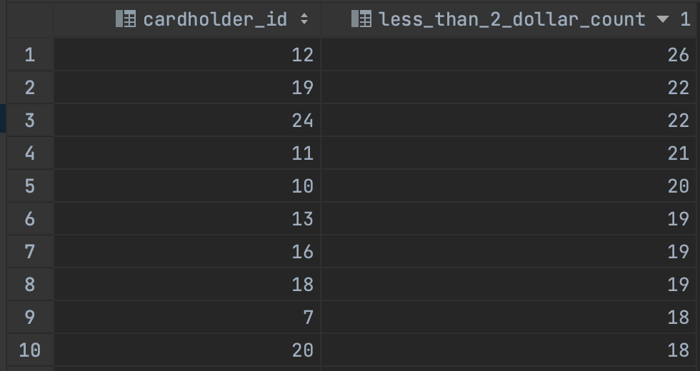
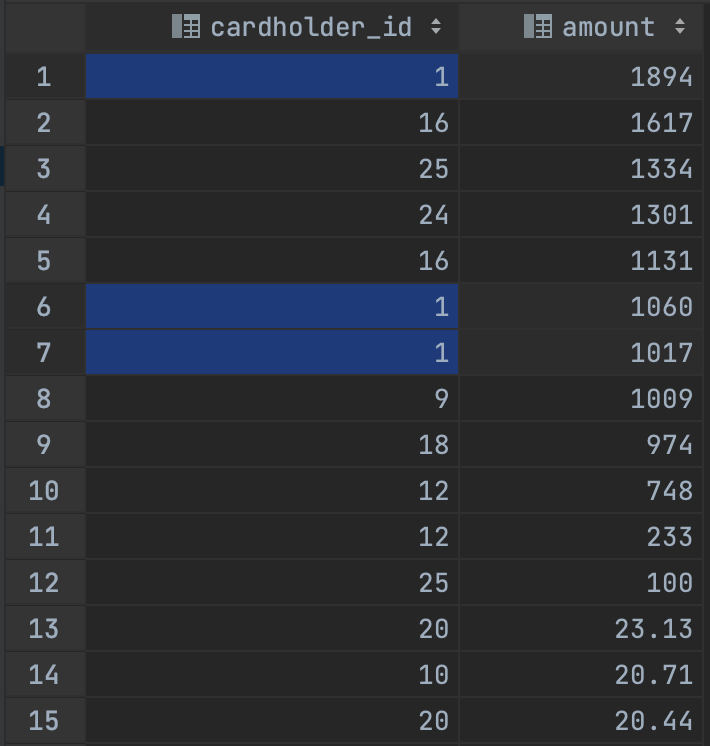
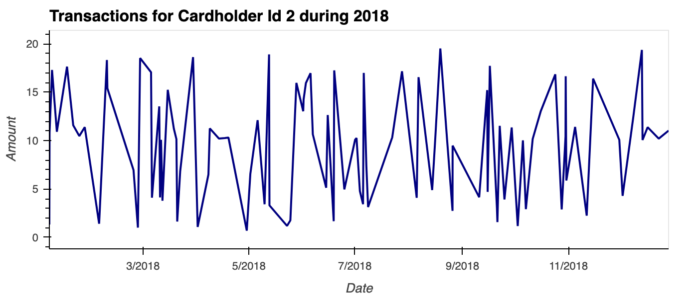
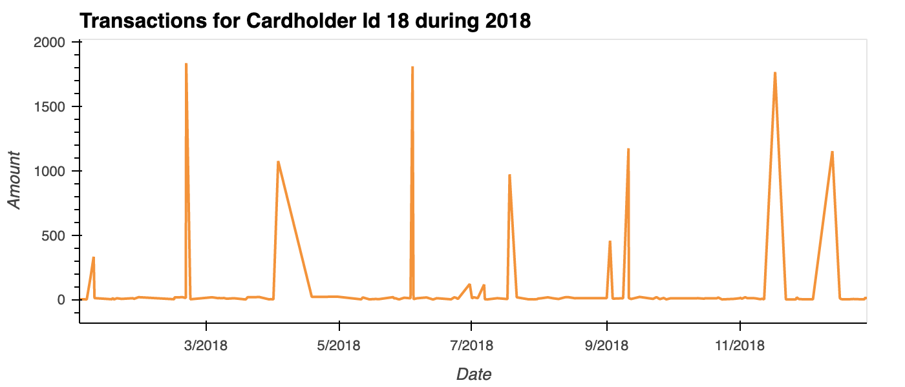
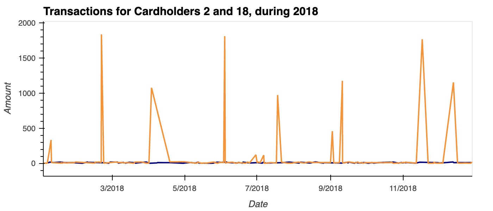
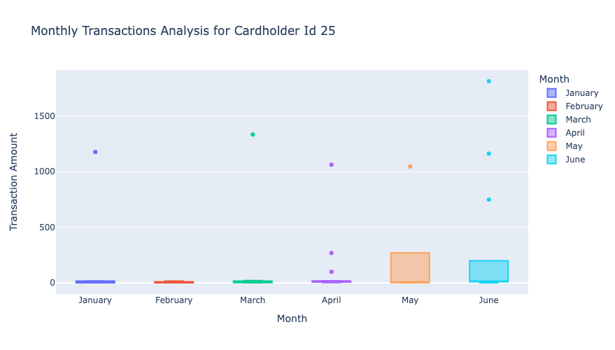

# Data analytics to identify possible fraudulent transactions
Script that uses SQL (Structured Query Language) to analyse historical credit card transactions and consumption patterns 
in order to identify possible fraudulent transactions and/or abnormal charges.

## Data sources
* [card_holder.csv](./Data/card_holder.csv)
* [credit_card.csv](./Data/credit_card.csv)
* [merchant.csv](./Data/merchant.csv)
* [merchant_category.csv](./Data/merchant_category.csv)
* [transaction.csv](./Data/transaction.csv)

## Tasks to support the Analysis of the data
1. **Data Modeling**: Defining a database model to store the credit card transactions data and create a new PostgreSQL 
database using the model.

2. **Data Engineering**: Creating a database schema on PostgreSQL and populating a database from the CSV files available.
3. **Data Analysis**: Analyzing the data to identify possible fraudulent transactions data trends, and generate a report 
with observations.

## Technical Environment
This application utilises the following technologies:
- **PostgreSQL**: [Documentation](https://www.postgresql.org/)
- **SQLAlchemy**: [Documentation](https://www.sqlalchemy.org/)
- **pgAdmin**: [Documentation](https://www.pgadmin.org/)
- **Pandas** DataFrame: [Documentation](https://pandas.pydata.org/docs/reference/frame.html)
- **hvplot** Bar chart, Line plot, GeoViews:  [Documentation](https://hvplot.holoviz.org/getting_started/hvplot.html)
- **Plotly** Box Plot:  [Documentation](https://plotly.com/python/box-plots/)

## Working with this tool

### Pre-requisites
1. Setup Python, Conda, Anaconda, JupyterLab and PostgreSQL in your computer.
2. Install SQLAlchemy.
3. Install pgAdmin or any other DB management tool compatible with PostgreSQL.

### Data Engineering - How to create a database and import the supporting data
1. Establish a connection with PostgreSQL using your DB management tool.
2. Create a new database manually or by running the queries in the [create_db.sql](./Data/create_db.sql) file.
3. Using the new database, run all queries from the [schema.sql](./Data/schema.sql) file to create the Tables.
4. Using the new database, run all queries from the [all_tables_seed.sql](./Data/all_tables_seed.sql) file to import the data.

### Data Analysis
1. To run the **Analysis via SQL queries**, use your DB management tool to establish a connection to the DB previously 
created and run all queries from the [queries.sql](./Data/queries.sql) file and generate all the Views.
2. To run the **Visual Data Analysis**, open the [visual_data_analysis.ipynb](visual_data_analysis.ipynb) file in Jupyter 
Lab and modify the postgresql connection string according to your setup. Then run all the cells to generate the necessary 
dataframes and plots.

---

# Report
The data available has been processed with SQL queries and organised into meaningful groups as an attempt to identify 
fraudulent transactions. These logical groups have been stored as Views for further examination:
- transactions_by_cardholder
- transactions_between_7_and_9
- trans_less_than_two_by_cardholder
- trans_less_than_two_by_merchant

> Upon evaluating the transactions that are less than $2.00 per Cardholder, although the number of operations is higher 
> for some Cardholders, at this point there is not enough evidence to suggest that one or more of the Credit Cards have 
> been hacked. (Please refer to image below)

*Sample of the transactions count with less than $2.00 amount per cardholder*

> When extracting the top 100 highest transactions made between 7:00 am and 9:00 am, one can notice that there are 10 
> transactions with an unusual high amount. In addition, 3 of those transactions are associated to Cardholder 1, thus the 
> data for Cardholder 1 should be examined in more detail. However, for other Cardholders this is not enough information 
> to suggest these operations are fraudulent yet. (Please refer to image below)

*Sample of transactions made between 7:00 am and 9:00 am*

> Given the total number of transactions (3500) in our Database, this sample does not suggest anything conclusive yet. 
> We cannot assert there is a higher number of fraudulent transactions made between 7:00 am and 9:00 am versus the rest of 
> the day, as we haven't run the same queries for other timeframes.

## Visual Analysis for Cardholders 2 and 18

> The Line Plot displaying the historical data for Cardholder 2 suggests a regular transaction pattern. All amounts are 
> within what it looks like a normal range for this Client. (Please refer to image below)

> The same cannot be said for Cardholder 18. Unfortunately, the Line Plot for their historical data indicates a number of 
> transactions with an unusually higher amount when compared with the rest, these are most likely fraudulent transactions.
> The data confirms the Credit Card of this Customer has been hacked. (Please refer to image below)

> When combining the data of both Cardholders, it is even more obvious that the consumption pattern for Cardholder 18 is
> abnormal. (Please refer to image below)

## Visual Analysis for Cardholder 25

> Regarding the expenditure data for Cardholder 25, the Box Plot for the transactions paid for between January and June 
> 2018 shows 9 outliers; three during April and June, and one on January, March and May. As the CEO suspects, this 
> confirms someone has been dishonestly using the company's credit card to pay for very expensive bills. (Please refer 
> to image below). In addition, the consumption pattern is abnormally higher for the months of May and June, thus worth 
> further investigation. In the meantime, we suggest this Credit Card should be immediately cancelled.

