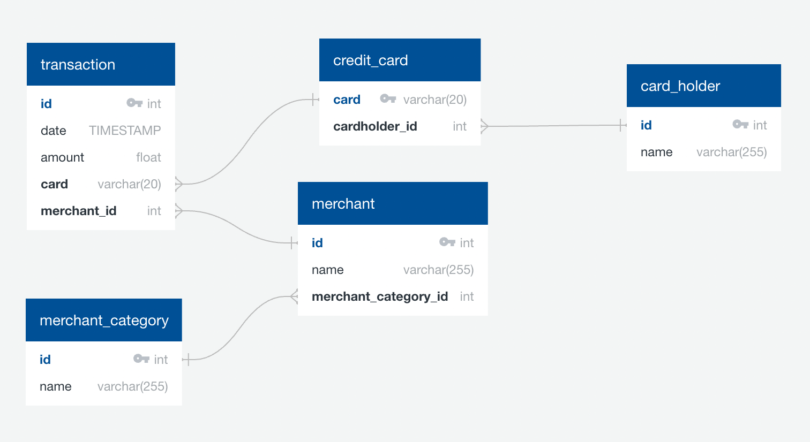

# Data analytics to identify possible fraudulent transactions
Script that uses SQL (Structured Query Language) to analyse historical credit card transactions and consumption patterns 
in order to identify possible fraudulent transactions and/or abnormal charges.

## Data sources
* [card_holder.csv](./Data/card_holder.csv)
* [credit_card.csv](./Data/credit_card.csv)
* [merchant.csv](./Data/merchant.csv)
* [merchant_category.csv](./Data/merchant_category.csv)
* [transaction.csv](./Data/transaction.csv)

## Tasks to support the Analysis of the data
1. **Data Modeling**: Defining a database model to store the credit card transactions data and create a new PostgreSQL 
database using the model.

2. **Data Engineering**: Creating a database schema on PostgreSQL and populating a database from the CSV files available.
3. **Data Analysis**: Analyzing the data to identify possible fraudulent transactions data trends, and generate a report 
4. with observations.

## Technical Environment
This application utilises the following technologies:
- **PostgreSQL**: [Documentation](https://www.postgresql.org/)
- **SQLAlchemy**: [Documentation](https://www.sqlalchemy.org/)
- **pgAdmin**: [Documentation](https://www.pgadmin.org/)
- **Pandas** DataFrame: [Documentation](https://pandas.pydata.org/docs/reference/frame.html)
- **hvplot** Bar chart, Line plot, GeoViews:  [Documentation](https://hvplot.holoviz.org/getting_started/hvplot.html)

## How to work with this repository
1. Setup PostgreSQL in your computer.
2. Install SQLAlchemy.
3. Install pgAdmin or any other DB management tool compatible with PostgreSQL.
4. Established a connection with PostgreSQL using your DB management tool.
5. Create a new database manually or by running the queries in the [create_db.sql](./Data/create_db.sql) file.
6. Using the new database, run all queries in the [schema.sql](./Data/schema.sql) file to create the tables.
7. Using the new database, run all queries in the [all_tables_seed.sql](./Data/all_tables_seed.sql) file to import the data.

## Disclaimer
> Lorem ipsum dolor sit amet, consectetur adipiscing elit. In ultrices, sem ut tempus dapibus, justo diam placerat tellus, 
> condimentum dictum velit neque ac lacus. Fusce enim ligula, fermentum et commodo rhoncus, porttitor vel tortor. Donec 
> lacinia erat ac ante pellentesque, quis vestibulum odio congue. Fusce lobortis ligula tincidunt leo molestie, a 
> tincidunt metus egestas. Fusce pharetra ex vel turpis accumsan blandit. Etiam iaculis placerat lorem a feugiat. Class 
> aptent taciti sociosqu ad litora torquent per conubia nostra, per inceptos himenaeos. Proin convallis augue vel elit 
> faucibus suscipit.